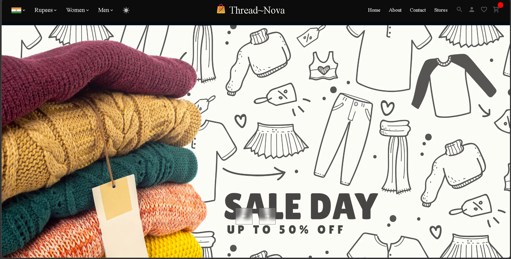

# 🛍️ Thread~Nova v2

> A production-grade full-stack ecommerce web app — upgraded from v1 (React + JS) to a fully typed, authenticated, and optimized v2.



## 🔗 Links

- **Live Demo:** [thread-nova-v2.vercel.app](https://thread-nova-v2.vercel.app)
- **v1 (original):** [ThreadNova-Ecommerce](https://github.com/SumantKrSingh/ThreadNova-Ecommerce)

---

## ✨ What's new in v2

| Feature          | v1          | v2                          |
| ---------------- | ----------- | --------------------------- |
| Language         | JavaScript  | TypeScript                  |
| Auth             | None        | Firebase Auth               |
| Folder structure | Flat        | Industry-grade              |
| Form handling    | useState    | react-hook-form + yup       |
| UI components    | Custom only | MUI + Custom SCSS           |
| Code quality     | None        | Husky + ESLint + Prettier   |
| Routing          | Basic       | Lazy loading + PrivateRoute |
| Wishlist         | None        | Per-user with Redux         |

---

## 🛠️ Tech stack

### Frontend

- React 18 + TypeScript
- Vite 8
- Redux Toolkit + Redux Persist
- Firebase Authentication
- Material UI (MUI)
- react-hook-form + yup
- Axios
- React Router v6
- SCSS

### Backend

- Strapi CMS (deployed on Strapi Cloud)
- Stripe Payment Gateway

### Dev tools

- Husky pre-commit hooks
- ESLint + Prettier
- Lazy loading + Suspense
- Git + GitHub

---

## 📁 Folder structure

```
client/src/
  api/          → axios instances
  services/     → Firebase auth service
  types/        → TypeScript interfaces
  routes/       → AppRouter + PrivateRoute
  hooks/        → useFetch, useAppDispatch, useAppSelector
  utils/        → constants, getImage helper
  context/      → ThemeContext (dark/light mode)
  redux/
    cart/       → cartSlice
    auth/       → authSlice
    wishlist/   → wishlistSlice
  components/   → reusable UI components
  pages/        → Home, Products, Product, Login, Signup, Profile, Wishlist, About, Contact, Stores
  styles/       → global SCSS mixins
```

---

## 🚀 Features

- 🔐 **Firebase Auth** — Email/Password login and signup
- 🛒 **Cart** — Add/remove items, persisted with Redux Persist
- ❤️ **Wishlist** — Save products, requires login
- 🔍 **Filter** — By gender, category, price range
- 💳 **Stripe** — Real payment integration
- 🌙 **Dark/Light theme** — Toggle with smooth transition
- ⚡ **Lazy loading** — All pages load on demand
- 🔒 **Protected routes** — Wishlist + Profile require auth
- 📱 **Responsive** — Mobile menu + responsive grid
- 🛡️ **Pre-commit hooks** — Husky blocks bad commits

---

## 🏃 Run locally

```bash
git clone https://github.com/SumantKrSingh/ThreadNova-V2.git
cd ThreadNova/client
npm install
cp .env.example .env   # add your keys
npm run dev
```

---

## 🔑 Environment variables

```
VITE_APP_API_URL=your_strapi_url
VITE_APP_API_TOKEN=your_strapi_token
VITE_APP_UPLOAD_URL=your_upload_url
VITE_STRIPE_KEY=your_stripe_key
VITE_FIREBASE_API_KEY=your_firebase_key
VITE_FIREBASE_AUTH_DOMAIN=your_auth_domain
VITE_FIREBASE_PROJECT_ID=your_project_id
VITE_FIREBASE_STORAGE_BUCKET=your_bucket
VITE_FIREBASE_MESSAGING_SENDER_ID=your_sender_id
VITE_FIREBASE_APP_ID=your_app_id
```

---

## 📸 Screenshots

| Page           | Preview                               |
| -------------- | ------------------------------------- |
| Home           |          |
| About          |        |
| Contact        |      |
| Stores         |       |
| Login          |        |
| Cart           |         |
| Wishlist       |  |
| Products       |  |
| Product Detail |    |

---

## 👨‍💻 Author

**Sumant Kumar Singh**

- GitHub: [@SumantKrSingh](https://github.com/SumantKrSingh)
